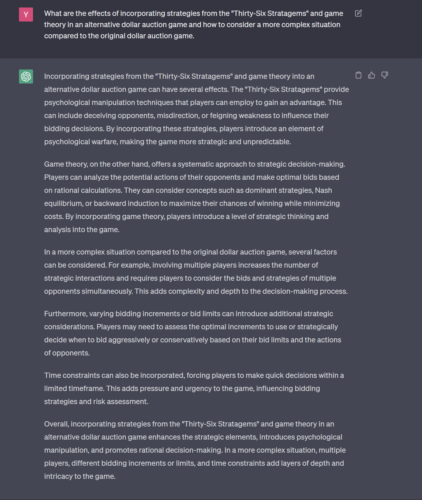
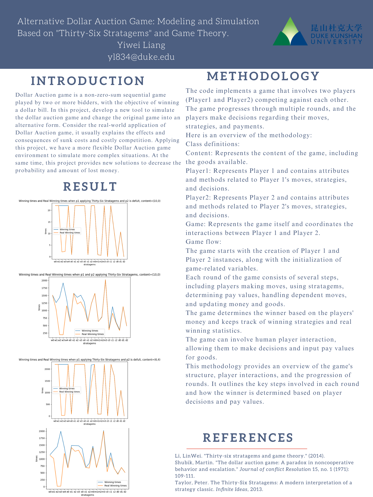

# Alternative Dollar Auction Game: Modeling and Simulation Based on "Thirty-Six Stratagems" and Game Theory.
## Project information
- **Author**: Yiwei Liang, Computation and Design with tracks in Computer Science, Class of 2025, Duke Kunshan University
- **Instructor**: Prof. Luyao Zhang, Duke Kunshan University
- **Disclaimer**: Submissions to the Problem Set No. or Final Project for [COMPSCI/ECON 206 Computational Microeconomics, 2023 Spring (Seven Week - Second)](https://ce.pubpub.org/) instructed by Prof. Luyao Zhang at Duke Kunshan University.
### **Project Summary**: 
  -  Dollar Auction game is a non-zero-sum sequential game played by two or more bidders, intending to win a dollar bill. In this project, develop a new tool to simulate the dollar auction game and change the original game into an alternative form. Consider the real-world application of Dollar Auction game, it usually explains the effects and consequences of sunk costs and costly competition. Applying this project, we have a more flexible Dollar Auction game environment to simulate more complex situations. At the same time, this project provides new solutions to decrease the probability and amount of lost money. 
#### Research Question: What are the effects of incorporating strategies from the "Thirty-Six Stratagems" and game theory in an alternative dollar auction game and how to consider a more complex situation compared to the original dollar auction game?
#### Methodology
The code implements a game that involves two players (`Player1` and `Player2`) competing against each other. The game progresses through multiple rounds, and the players make decisions regarding their moves, strategies, and payments. Here is an overview of the methodology:
##### **Class Definitions**:
- `Content`: Represents the content of the game, including the goods available.
- `Player1`: Represents Player 1 and contains attributes and methods related to Player 1's moves, strategies, and decisions.
- `Player 2`: Represents Player 2 and contains attributes and methods related to Player 2's moves, strategies, and decisions.
- `Game`: Represents the game itself and coordinates the interactions between Player 1 and Player 2.
##### Game Flow:
1. The game starts with the creation of Player 1 and Player 2 instances, along with the initialization of game-related variables.
2. Each round of the game consists of the following steps:
   - Player 1 and Player 2 make their moves by calling the `player_move` method.
   - If the players are AI-controlled, a random strategy is chosen. Otherwise, the human player is prompted for their actions.
   - Players decide whether to use stratagems or not. If they choose to use stratagems, they select a specific stratagem and execute it using the `which_stra` method.
   - Players determine their actual pay values for goods and the tell values they want to convey to the opponent.
   - The game handles dependent moves, adjusting pay values based on the opponent's tell values and a random factor.
   - Money and goods are updated based on the pay values and a decreased rate.
   - The game determines the winner based on the players' money. The winning player is recorded, along with the winning strategies used.
3. The game continues for multiple rounds until completion.
4. The game keeps track of the real winning results by comparing each player's money to their initial money.
5. The game ends, and the final results are available, including the winner, winning strategies, and real winning statistics.

- **Additional Feature**:

- The game allows for human-player interaction, where the human player can make decisions and input pay values for goods when using strategies that depend on the opponent's tell values.

This methodology provides an overview of the game's structure, the player interactions, and the progression of rounds. It outlines the key steps involved in each round and how the winner is determined based on player decisions and pay values.
  ### Results:
- Paying a higher value increases the probability of winning the game: The code suggests that players who pay a higher value for goods have a higher chance of winning. This implies that investing more money in goods can potentially lead to a favorable outcome. However, it's important to note that paying a higher value also carries a higher risk of losing value. Players need to find a balance between paying enough to increase their winning probability and avoiding excessive losses.
- Splitting action goods can lead to a more complex situation and reduce damage from irrational opponent options: The code indicates that players have the option to split their actions among different goods. This strategy can make the game more intricate by introducing multiple variables for opponents to consider. It can also serve as a defensive measure against opponents' unpredictable moves, minimizing the impact of their irrational decisions. By diversifying their actions, players can increase their chances of success and mitigate potential losses.
  ### [Intellectual Merits and Practical Impacts of your project.]
#### Intellectual Merits:
- Algorithmic Analysis: The project involves analyzing game strategies and decision-making processes using algorithmic techniques. Examining various factors such as payment values, goods distribution, and strategic choices, contributes to the understanding of optimal game-playing strategies.
- Game Theory: The code implementation demonstrates practical applications of game theory principles. It explores the dynamics between two players, their strategies, and the resulting outcomes. This contributes to the field of game theory by providing empirical data on the effectiveness of different strategies.
#### Practical Impacts:
- Strategic Planning: The project can be utilized in various practical scenarios that involve strategic planning and decision-making. Industries such as finance, marketing, and military planning could benefit from analyzing game strategies and understanding the implications of different choices.
- Risk Management: The project sheds light on the risks associated with different actions in a game. It highlights the importance of assessing potential losses and developing risk management strategies. This knowledge can be applied to real-world situations, such as investment decisions or competitive market analysis.
- In conclusion, the project is useful and meaningful as a tool and new solution.
   
Note: Please insert the screenshot of the answers to your research question by ChatGPT. The methodology that you use to address the research questions must be more innovative than both the current literature and ChatGPT. <br>
Here is the screenshot by ChatGPT.<br>

## Table of Contents

- model
- code
- spotlight
- more about the author
- references
#### Model
##### Game Environment
- Players: There are two players, namely Player 1 and Player 2. They can be controlled by humans or an AI.
- Goods: There are two types of goods, namely good1 and good2. Each player has the option to pay a certain amount for each good. The value of the good depends on the
- Stratagems: There are various stratagems available to players, each with its effects and outcomes. Players can choose to use stratagems or not.
- Money: Each player starts with an initial amount of money. The money can be used to pay for goods or can be earned during the game.
- Communication: Players can communicate with each other through the game. They can choose to tell the truth or deceive their opponent about the amount they are willing to pay for goods.
- Winning: The player with the higher amount of money at the end of the game is declared the winner. The code keeps track of the number of wins for each player and the frequency of using different stratagems.
- In general, the game environment is a two-player strategic competition. Each player can choose to use different stratagems or make direct moves. They compete to accumulate the highest amount of money by paying for goods. Players have the option to communicate and can either tell the truth or deceive their opponent about their payment intentions. The game is played in rounds, and the winner is determined based on the player with the highest amount of money at the end of the game.
- Solution Concept: In this game, the players make strategic decisions based on their chosen strategies and the current state of the game (including their own and the opponent's actions and payoffs). The goal is to maximize their payoffs over multiple rounds.
- Evaluations: The efficiency of the game depends on optimal resource allocation and strategy effectiveness. Since all built-in strategies hav a certain number of winning games, which means all the strategies are reasonable. At the same time, the payoff of the players depends on the strategies they use, which is from the actual value of the goods until negative. This shows that the efficiency and the fairness of the game are tested.
### Code
#### Game Environment
- The game environment is implemented using the following code. It consists of several classes, including the Content, Player1, Player2, and Game classes.
- The Content class represents the goods available in the game. Each player has an initial amount of these goods.
- The Player1 and Player2 classes represent the players in the game. They have attributes such as money, goods, stratagems, and their corresponding actions. Players can be controlled by humans or AI, and they make moves based on user input or random selection.
- The Game class manages the overall game flow. It keeps track of the players, their moves, the winner, and the usage of stratagems. The game is played in rounds, where each player makes their moves, and the money and goods are updated based on the decisions made. The winner is determined based on the final amounts of money, and statistics are maintained regarding the winning player and the usage of different stratagems.
- Overall, the code provides the necessary structure and logic to simulate the game environment, allowing players to make strategic decisions and compete against each other to achieve the highest amount of money.
#### Strategic plays
##### To analyze the strategic plays based on the provided code, we can examine the winning times and real winning times for different strategies and content configurations:
- Game Initialization:<br>
The code sets up different content configurations using the Content class. Two configurations are considered: Content(10, 0) and Content(6, 4). These configurations represent the initial goods available to the players in the game.
- Strategy Play:<br>
If the player is an Ai, there will be choices available from the Strategy class, which is based on the "Thirty-Six Stratagems". The strategy has different paying preferences and telling preferences. Based on the set strategies, ai will have its paying ideas. <br>
Since the strategies are built in the Strategy class, this means the available choices for Ai are set in the Strategy class.
##### Strategy Analysis:
- Winning strategies mean the player is more confident and prefers to pay more money to make the opponent lose instead of getting the most benefit with the least cost.
- Enemy dealing stratagemsfocuses on dealing with opponents who are on an equal footing. The payoff change depends on the opponent's strategies and their reactions to the player's actions.
- Offensive stratagems are used when the player is in an advantageous position and wants to maintain their advantage or further dominate the opponent. The payoff change depends on the player's ability to execute the chosen offensive strategy and prevent the opponent from turning the tables.
- Melee stratagems are employed in chaotic situations where alliances are uncertain, and players may switch sides. The payoff change depends on the player's ability to adapt and make tactical decisions to minimize losses and maximize gains.
- Combined stratagems' payoff change depends on the player's ability to anticipate and respond to changes in alliances while maintaining their own interests.
- Defeat Stratagems are employed when players are at a disadvantage and need to turn the situation in their favor. The payoff change depends on the player's choices.
#### Overleaf Project
[Here is the pdf](https://github.com/Rising-Stars-by-Sunshine/CS-ECON206_Yiwei_Liang_Final_Project/blob/main/code/CSECON206FinalProject.pdf)
#### Colab Project
[Here is the file](https://github.com/Rising-Stars-by-Sunshine/CS-ECON206_Yiwei_Liang_Final_Project/blob/main/code/Final_Project.ipynb)
### Spotlight
- Posters<br>

- Slides<br>
[https://github.com/Rising-Stars-by-Sunshine/CS-ECON206_Yiwei_Liang_Final_Project/blob/main/spotlight/presentation.pptx]<br>
(Here is the slides)

### More about the Author
- 
- self-introduction<br>
 Yiwei Liang is a sophomore student majored in Computation and Design with tracks in Computer Science at DKU. Yiwei is interested in Ai-painting and voice clone project, has few experience of applying vits and so-vits projects.
- Final reflections 
  - intellectual growth
  - professional growth
  - living a purposeful life

### References

- Literature References in [Chicago Author-Date](https://www.chicagomanualofstyle.org/tools_citationguide/citation-guide-2.html) Style and [BibTex](https://scholar.google.com/) 

Levin, Dan, and Luyao Zhang. 2020. “Bridging Level-K to Nash Equilibrium.” *The Review of Economics and Statistics* 104 (6): 1329–40. https://doi.org/10.1162/rest_a_00990.

```
@misc{verstappen2017thirty,
  title={The Thirty-Six Strategies},
  author={Verstappen, Stefan H},
  year={2017},
  publisher={Woodbridge Press, Toronto}
}
@article{tung1994strategic,
  title={Strategic management thought in East Asia},
  author={Tung, Rosalie L},
  journal={Organizational Dynamics},
  volume={22},
  number={4},
  pages={55--65},
  year={1994},
  publisher={Elsevier}
}
@article{葛存根2003三十六计,
  title={《 三十六计》 的变理心理及其管理定位},
  author={葛存根 and 朱永新},
  journal={心理科学},
  volume={26},
  number={3},
  pages={411--414},
  year={2003}
}
@article{levin2022bridging,
  title={Bridging level-k to nash equilibrium},
  author={Levin, Dan and Zhang, Luyao},
  journal={Review of Economics and Statistics},
  volume={104},
  number={6},
  pages={1329--1340},
  year={2022},
  publisher={MIT Press One Rogers Street, Cambridge, MA 02142-1209, USA journals-info~…}
}
```

